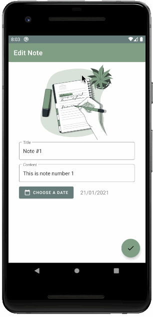

# Simple note app
Basic app to display, create and edit notes saved in SharedPreferences. After successful note modification or creation, a notification is triggered.
Note images can be individualized by choosing photos from the image gallery.

Assignment.

## Libraries, techniques and features
* Navigation Component
* SharedPreferences
* Notifications
* Permissions
* Photo Gallery Access
* Material Design

## Screencast Example
Screencast of the app running on Android emulator

